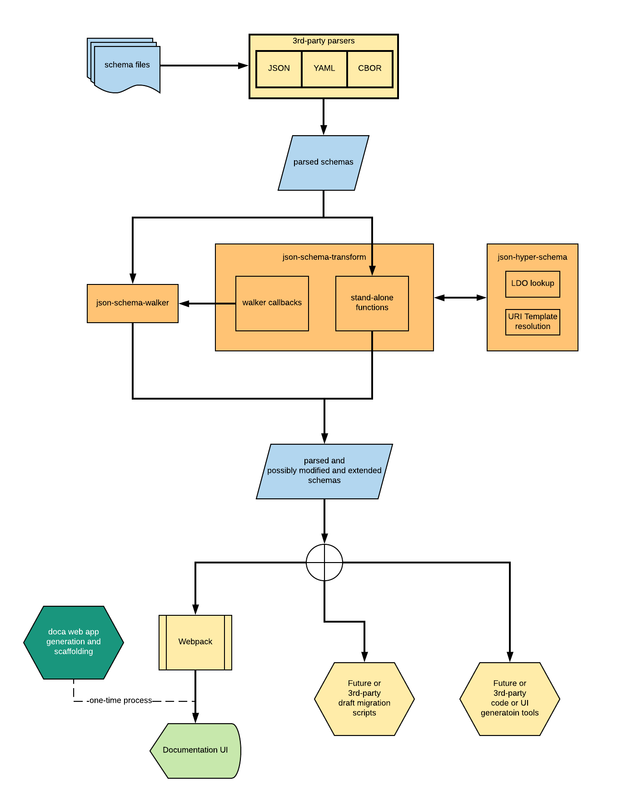

# JSON Schema Tools

This is a monorepo of packages for working with
[JSON Schema and JSON Hyper-Schema](http://json-schema.org),
built using [Lerna](https://github.com/lerna/lerna) and
[Yarn Workspaces](https://yarnpkg.com/lang/en/docs/workspaces/).

The repo includes everything from generic utilities to small applications
built on these and other packages.

The packages are intended for general use, so
while they may support some Cloudflare extensions to JSON Schema,
they should all be usable with schemas that rely only on the
standard keywords and features.

## Note that these packages have not yet reached a stable interface

Interfaces will change and packages will be refactored until each package
reaches a 1.0 status.  This will likely occur once JSON Schema [draft-08](https://github.com/json-schema-org/json-schema-spec/milestone/6), which
will have some very significant new features, is finalized.  In particular,
the concept of a Schema Vocabulary appears in several locations but is neither
well nor consistently managed in the current code.  Draft-08 will formalize
that concept.

If you are interested in building on these packages, please file an issue indicating what you need to use and we will work to ensure reasonable levels of support as we finalize the interfaces.

## The packages

Packages fall into a few categories.  Currently, the packages in this repository
focus on static manipulation and processing of schemas, in particular for
generating API documentation.  The following diagram gives an overview of how this
and potentially other kinds of static processing work:

Additional packages will likely add runtime functionality, including automated API
testing support based on JSON Hyper-Schema.

### `@cloudflare/json-schema-walker`

[`json-schema-walker`](workspaces/json-schema-walker/README.md) is the most fundamental static schema processing package: it is aware of subschema applicators and uses that knowledge to walk over a schema and make callbacks before and/or after visiting any subschemas.

Most schema transformations work by changing a schema object after its subschemas have been visited, so that all transformations are guaranteed to have already been applied to any subschemas.

There are variants for visiting all schemas including the root, as well as for only visiting subschemas.

### `@cloudflare/json-schema-transform`

[`json-schema-transform`](workspaces/json-schema-transform/README.md) is a collection of utility functions, most of which are either callbacks intended for use with `json-schema -walker`, or make use of `json-schema-walker` internally.  This package will eventually include transforms for converting one draft to another.

Among other things, this makes replacements for the internals of the deprecated `json-schema-example-loader` package available outside of Webpack.  See `json-schema-apidoc-loader` for use with Webpack.

### `@cloudflare/json-hyper-schema`

[`json-hyper-schema`](workspaces/json-hyper-schema/README.md) is an implementation of the JSON Hyper-Schema specification, supporting both static (currently) and dynamic (in the future) use of Hyper-Schemas.  Eventually, we hope to build a fully-featured hyperclient based on this package.

Currently, this just includes some utilities for looking up link description objects and resolving URI Templates from an instance.  Some of these utilities are replacements for internals of the deprecated `json-schema-example-loader`.

### `@cloudflare/json-schema-test`

_This package has not yet been created._

Applies schema validation to API requests and responses.  This will primarily leverage JSON Hyper-Schema but other utilities such as a [Jest](https://facebook.github.io/jest/) matcher for regular schema validation will be included.

## Applications and application support

Currently, the only application provided is an API documentation system known as "Doca".  This is a refactored and re-designed version of [our existing Doca suite](https://github.com/cloudflare/doca)

### `@cloudflare/doca`

Scaffolding system to generate API documentation apps.

Replaces the existing `doca` package, which is now deprecated.

### `@cloudflare/doca-default-theme`

The default UI for documentation apps scaffolded by `@cloudflare/doca`.

Will eventually fully replace `doca-bootstrap-theme`, but currently this is a bare-bones display of the processed JSON Schemas.  It is provided mainly for debugging purposes and as a starting point for 3rd-party UI themes.

### `@cloudflare/json-schema-ref-loader`

[Webpack](https://webpack.js.org/) loader that uses `json-schema-transform` and other packages to load schemas written in JSON, JSON5, YAML, or JavaScript formats and dereference all `$ref` occurrences.  All referenced schemas are added as dependencies.

Currently this loader can only be used with schemas that do not have any cyclic references as dereferencing is the only option for loading.

Replaces `json-schema-loader`

### `@cloudflare/json-schema-apidoc-loader`

[Webpack](https://webpack.js.org/) loader that uses `json-schema-transform` and other packages to convert de-referenced (no `$ref`s) into a form suitable for generating documentation, including examples.

Replaces `json-schema-example-loader`

## Installation

### Installing and using a single package

Find the package in the [`workspaces/` directory](workspaces) and
open its README.md for documentation.

## Installing the monorepo

Please use recent versions of lerna (2+), node (6+) and yarn (v1+).
Simply clone the repository and run `lerna bootstrap`, which will
use yarn.  A known good version of yarn is included in
the `scripts` directory and configured in this repository's `.yarnrc`.

